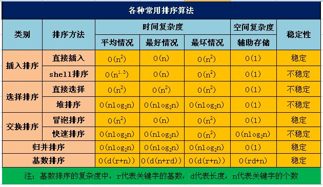

# 排序算法

## 排序对比

| 排序场景      | 排序效率                         |
| ------------- | -------------------------------- |
| Random        | 希尔>快排>归并                   |
| Few unique    | 快排>希尔>归并                   |
| Reversed      | 快排>希尔>归并                   |
| Almost sorted | 插入排序>基数排序>快排>希尔>归并 |

**总结来看**: 快速排序和希尔排序在排序速度上表现是比较优秀的,而归并排序稍微次之

## 排序算法时间空间复杂度



## 气泡排序

### 实现原理

气泡排序也是冒泡排序，其原理是从列表第一个元素开始，将他与他的下一个元素进行对比，如果当前元素大于下一个元素则交换顺序，否则不，然后每个元素进行一轮。因此他的时间复杂度为**O(n2)**,最好的情况下是**O(n)**

### 算法实现

```java
    public static void bubbleSort(int[] arr){
        for (int i = 0; i < arr.length; i++) {
            boolean flag = true;
            for (int j = 0; j < arr.length - 1-i; j++) {
                if(arr[j]>arr[j+1]){
                    int temp=arr[j];
                    arr[j]=arr[j+1];
                    arr[j+1]=temp;
                    flag= false;
                }
            }
            if(flag) break;
        }
    }
```

### 优化方法 

可以看出，在准备对比之前，先设置一个哨兵，该哨兵的作用是判断当前一轮是否发生了对比，如果没有则直接退出排序。

## 快速排序

### 实现原理

快速排序其实就是寻找一个标准点，然后放两个指针，一个指向从数组最左边开始，一个从数组最右边开始。先从右边指针开始，右边指针如果指向比标准点的值小的时候，则与左指针指向的值进行交换，否则继续左移动，直到交换，然后左指针当前所指值与其标准点的值比较，如果比他大则与右指针的值进行交换。然后往返一个流程。直到标准值右边的值是小值，左边是大值。然后从左区间继续开始。使用递归继续开始排序。

### 算法实现

~~~java
   //快速排序
    public static void quickSort(int[] a, int l, int r) {
        if (l < r) {
            int i,j,x;
            i = l;
            j = r;
            x = a[i];
            while (i < j) {
                while(i < j && a[j] > x)
                    j--; // 从右向左找第一个小于x的数
                if(i < j)
                    a[i++] = a[j];
                while(i < j && a[i] < x)
                    i++; // 从左向右找第一个大于x的数
                if(i < j)
                    a[j--] = a[i];
            }
            a[i] = x;
            quickSort(a, l, i-1); /* 递归调用 */
            quickSort(a, i+1, r); /* 递归调用 */
        }
    }
~~~

## 插入排序

插入排序其实就是将数组分为一个有序和无序两个数组，假设第0个值是有序，然后从第1值开始是无序区间，从无序区间的第一个值开始在有序区间里面寻找该值得位置。时间复杂度为0（n2）  其为稳定排序

## 希尔排序

希尔排序是指将数组分为小于数组长度的步长值，所有距离为步长值得项在一个集合中，然后对集合中的数组进行选择排序，然后减少步长值进行下一次排序，知道步长值等于1的时候。其时间复杂度为最坏为o(n2),最好为o(n),平均值为o(n1.5)左右。

## 归并排序


## 明天早晨起来任务 先是理解 归并 快速 希尔排序 然后看一下锁的机制 以及经典的锁的算法 

## 然后开始背


